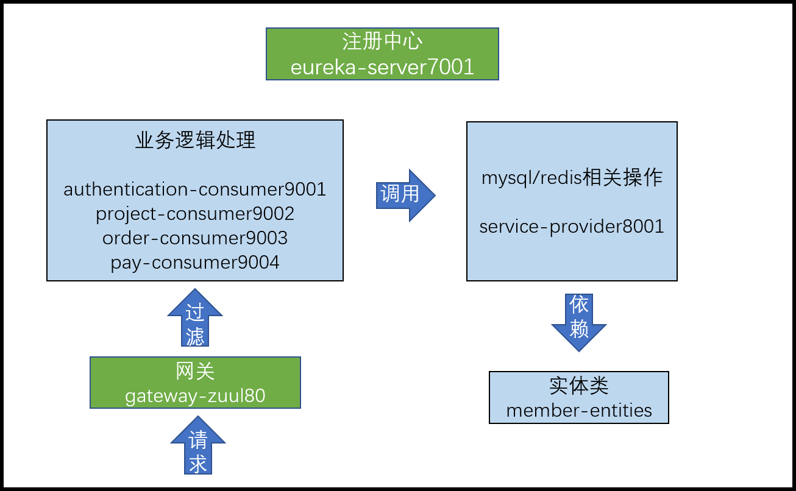

# 会员系统

## 1 环境搭建

### 1.1 项目架构图



### 1.2 crowdfunding-member父工程

pom.xml

```xml
<?xml version="1.0" encoding="UTF-8"?>
<project xmlns="http://maven.apache.org/POM/4.0.0"
         xmlns:xsi="http://www.w3.org/2001/XMLSchema-instance"
         xsi:schemaLocation="http://maven.apache.org/POM/4.0.0 http://maven.apache.org/xsd/maven-4.0.0.xsd">
    <modelVersion>4.0.0</modelVersion>

    <groupId>com.member</groupId>
    <artifactId>crowdfunding-member</artifactId>
    <version>1.0-SNAPSHOT</version>
    <packaging>pom</packaging>

    <properties>
        <maven.compiler.source>11</maven.compiler.source>
        <maven.compiler.target>11</maven.compiler.target>
    </properties>

    <dependencyManagement>
        <!--spring boot 2.2.2-->
        <dependencies>
            <dependency>
                <groupId>org.springframework.boot</groupId>
                <artifactId>spring-boot-dependencies</artifactId>
                <version>2.2.2.RELEASE</version>
                <type>pom</type>
                <scope>import</scope>
            </dependency>
            <!--spring cloud Hoxton.SR1-->
            <dependency>
                <groupId>org.springframework.cloud</groupId>
                <artifactId>spring-cloud-dependencies</artifactId>
                <version>Hoxton.SR1</version>
                <type>pom</type>
                <scope>import</scope>
            </dependency>
            <!--spring cloud alibaba 2.1.0.RELEASE-->
            <dependency>
                <groupId>com.alibaba.cloud</groupId>
                <artifactId>spring-cloud-alibaba-dependencies</artifactId>
                <version>2.1.0.RELEASE</version>
                <type>pom</type>
                <scope>import</scope>
            </dependency>
            <dependency>
                <groupId>mysql</groupId>
                <artifactId>mysql-connector-java</artifactId>
                <version>8.0.22</version>
            </dependency>
            <dependency>
                <groupId>com.alibaba</groupId>
                <artifactId>druid</artifactId>
                <version>1.2.4</version>
            </dependency>
            <dependency>
                <groupId>org.mybatis.spring.boot</groupId>
                <artifactId>mybatis-spring-boot-starter</artifactId>
                <version>2.1.4</version>
            </dependency>
            <dependency>
                <groupId>junit</groupId>
                <artifactId>junit</artifactId>
                <version>4.12</version>
            </dependency>
            <dependency>
                <groupId>log4j</groupId>
                <artifactId>log4j</artifactId>
                <version>1.2.17</version>
            </dependency>
            <dependency>
                <groupId>org.projectlombok</groupId>
                <artifactId>lombok</artifactId>
                <version>1.18.16</version>
                <optional>true</optional>
            </dependency>
            <!-- util工具模块-->
            <dependency>
                <groupId>com.project</groupId>
                <artifactId>crowdfunding-util</artifactId>
                <version>1.0-SNAPSHOT</version>
            </dependency>
        </dependencies>
    </dependencyManagement>

    <build>
        <plugins>
            <plugin>
                <groupId>org.springframework.boot</groupId>
                <artifactId>spring-boot-maven-plugin</artifactId>
                <configuration>
                    <fork>true</fork>
                    <addResources>true</addResources>
                </configuration>
            </plugin>
        </plugins>
    </build>

</project>
```

### 1.3 eureka-server7001模块

#### 依赖

```xml
<dependencies>
    <!--eureka-server-->
    <dependency>
        <groupId>org.springframework.cloud</groupId>
        <artifactId>spring-cloud-starter-netflix-eureka-server</artifactId>
    </dependency>
    <!--boot web actuator-->
    <dependency>
        <groupId>org.springframework.boot</groupId>
        <artifactId>spring-boot-starter-web</artifactId>
    </dependency>
    <dependency>
        <groupId>org.springframework.boot</groupId>
        <artifactId>spring-boot-starter-actuator</artifactId>
    </dependency>
    <!-- devtools-->
    <dependency>
        <groupId>org.springframework.boot</groupId>
        <artifactId>spring-boot-devtools</artifactId>
        <scope>runtime</scope>
        <optional>true</optional>
    </dependency>
</dependencies>
```

#### 配置

```yml
server:
  port: 7001

eureka:
  instance:
    hostname: localhost #eureka服务端的实例名称
  client:
    #false表示不向注册中心注册自己。
    register-with-eureka: false
    #false表示自己端就是注册中心，我的职责就是维护服务实例，并不需要去检索服务
    fetch-registry: false
    service-url:
      # 集群
      # 设置与Eureka Server交互的地址查询服务和注册服务都需要依赖这个地址。
      #      defaultZone: http://eureka7002.com:7002/eureka
      # 单机
      defaultZone: http://${eureka.instance.hostname}:${server.port}/eureka
```

#### 主启动

```java
@EnableEurekaServer
@SpringBootApplication
public class EurekaMain7001 {
    public static void main(String[] args) {
        SpringApplication.run(EurekaMain7001.class,args);
    }
}
```

### 1.4 逆向工程

#### 创建数据库表

```sql
create table member(
	id INT(11) NOT NULL auto_increment,
	loginacct VARCHAR(255) NOT NULL,
	userpswd CHAR(200) NOT NULL,
	username VARCHAR(255),
	email VARCHAR(255),
	authstatus INT(4) COMMENT '实名认证状态0 - 未实名认证， 1 - 实名认证申
	请中， 2 - 已实名认证',
	usertype INT(4) COMMENT ' 0 - 个人， 1 - 企业',
	realname VARCHAR(255),
	cardnum VARCHAR(255),
	accttype INT(4) COMMENT '0 - 企业， 1 - 个体， 2 - 个人， 3 - 政府',
	PRIMARY KEY (id)
);
```

#### 逆向工程

```xml
<!DOCTYPE generatorConfiguration PUBLIC
        "-//mybatis.org//DTD MyBatis Generator Configuration 1.0//EN"
        "http://mybatis.org/dtd/mybatis-generator-config_1_0.dtd">
<generatorConfiguration>
    <context id="simple" targetRuntime="MyBatis3">
        <!--         nullCatalogMeansCurrent=true 解决生成的实体类与数据库表不一样的问题-->
        <jdbcConnection driverClass="com.mysql.cj.jdbc.Driver"
                        connectionURL="jdbc:mysql://localhost:3306/crowdfunding?serverTimezone=UTC&amp;nullCatalogMeansCurrent=true"
                        userId="root"
                        password="bruce123" />

        <!--实体类-->
        <javaModelGenerator targetPackage="com.member.entities.po" targetProject="./crowdfunding-member/member-entities/src/main/java"/>
        <!--映射文件-->
        <sqlMapGenerator targetPackage="/resources/mapper" targetProject="./crowdfunding-member/service-provider8001/src/main"/>
        <!--接口类-->
        <javaClientGenerator type="XMLMAPPER" targetPackage="com.member.mapper" targetProject="./crowdfunding-member/service-provider8001/src/main/java"/>

        <table tableName="member" />
    </context>
</generatorConfiguration>
```

```java
public class MemberGenerator {
    public static void main(String[] args) {
        try {
            List<String> warnings = new ArrayList<String>();
            boolean overwrite = true;
            File configFile = new File("./crowdfunding-reverse/src/main/resources/generatorConfigMember.xml");
            ConfigurationParser cp = new ConfigurationParser(warnings);
            Configuration config = cp.parseConfiguration(configFile);
            DefaultShellCallback callback = new DefaultShellCallback(overwrite);
            MyBatisGenerator myBatisGenerator = new MyBatisGenerator(config, callback, warnings);
            myBatisGenerator.generate(null);
        } catch (Exception e) {
            e.printStackTrace();
        }
    }
}
```

### 1.5 member-entities模块

#### 实体类细分

- PO(Persistent Object)持久化对象

  用途1：将数据封装到PO 对象存入数据库
  用途2：将数据库数据查询出来存入PO 对象
  所以PO 对象是和数据库表对应，一个数据库表对应一个PO 对象

- VO(View Object)视图对象

  用途1：接收浏览器发送过来的数据
  用途2：把数据发送给浏览器去显示

- DO(Data Object)数据对象

  用途1：从Redis 查询得到数据封装为DO 对象
  用途2：从ElasticSearch 查询得到数据封装为DO 对象
  用途3：从Solr 查询得到数据封装为DO 对象
  ……
  从中间件或其他第三方接口查询到的数据封装为DO 对象

- DTO(Data Transfer Object)数据传输对象

  用途1：从Consumer 发送数据到Provider
  用途2：Provider 返回数据给Consumer

#### 依赖

```xml
<dependencies>
    <dependency>
        <groupId>org.projectlombok</groupId>
        <artifactId>lombok</artifactId>
    </dependency>
</dependencies>
```

### 1.6 service-provider8001

#### 依赖

```xml
<dependencies>
    <!-- 整合Redis -->
    <dependency>
        <groupId>org.springframework.boot</groupId>
        <artifactId>spring-boot-starter-data-redis</artifactId>
    </dependency>
    <!-- 整合Mybatis-->
    <dependency>
        <groupId>org.mybatis.spring.boot</groupId>
        <artifactId>mybatis-spring-boot-starter</artifactId>
    </dependency>
    <!-- MySQL 驱动-->
    <dependency>
        <groupId>mysql</groupId>
        <artifactId>mysql-connector-java</artifactId>
    </dependency>
    <!-- 数据库连接池-->
    <dependency>
        <groupId>com.alibaba</groupId>
        <artifactId>druid</artifactId>
    </dependency>
    <!-- SpringBoot 测试-->
    <dependency>
        <groupId>org.springframework.boot</groupId>
        <artifactId>spring-boot-starter-test</artifactId>
        <scope>test</scope>
    </dependency>
    <!-- 对外暴露服务-->
    <dependency>
        <groupId>org.springframework.boot</groupId>
        <artifactId>spring-boot-starter-web</artifactId>
    </dependency>
    <!-- 作为客户端访问Eureka 注册中心-->
    <dependency>
        <groupId>org.springframework.cloud</groupId>
        <artifactId>spring-cloud-starter-netflix-eureka-client</artifactId>
    </dependency>
    <!-- lombok-->
    <dependency>
        <groupId>org.projectlombok</groupId>
        <artifactId>lombok</artifactId>
    </dependency>
    <!-- 日志-->
    <dependency>
        <groupId>log4j</groupId>
        <artifactId>log4j</artifactId>
    </dependency>
    <!-- 单元测试-->
    <dependency>
        <groupId>junit</groupId>
        <artifactId>junit</artifactId>
    </dependency>
    <!-- 实体类模块-->
    <dependency>
        <groupId>com.member</groupId>
        <artifactId>member-entities</artifactId>
        <version>1.0-SNAPSHOT</version>
    </dependency>
    <!-- util工具模块-->
    <dependency>
        <groupId>com.project</groupId>
        <artifactId>crowdfunding-util</artifactId>
    </dependency>
    <!-- devtool-->
    <dependency>
        <groupId>org.springframework.boot</groupId>
        <artifactId>spring-boot-devtools</artifactId>
        <scope>runtime</scope>
        <optional>true</optional>
    </dependency>
</dependencies>
```

#### 配置

```yml
server:
  port: 8001
spring:
  application:
    name: service-provider
  datasource:
    type: com.alibaba.druid.pool.DruidDataSource
    driver-class-name:  com.mysql.cj.jdbc.Driver
    url: jdbc:mysql://localhost:3306/crowdfunding?serverTimezone=UTC&nullCatalogMeansCurrent=true
    username: root
    password: bruce123
  redis:
    database: 0
    host: 127.0.0.1
    port: 6379
    jedis:
      pool:
        # 连接池最大连接数，负数表示没有限制
        max-active: 20
        # 连接池最大阻塞等待时间，负数表示没有限制
        max-wait: -1
        # 连接池最大空闲链接
        max-idle: 10
        # 连接池最小空闲链接
        min-idle: 0
    # 链接超时时间
    timeout: 1000

eureka:
  client:
    #表示是否将自己注册进EurekaServer默认为true。
    register-with-eureka: true
    #是否从EurekaServer抓取已有的注册信息，默认为true。单节点无所谓，集群必须设置为true才能配合ribbon使用负载均衡
    fetchRegistry: true
    service-url:
      defaultZone: http://localhost:7001/eureka
  instance:
    instance-id: provider8001
    prefer-ip-address: true

mybatis:
  mapperLocations: classpath:mapper/*Mapper.xml
  type-aliases-package: com.member.entities.po    # 所有Entity别名类所在包
```

#### 主启动类

```java
@SpringBootApplication
public class ServiceProviderMain8001 {
    public static void main(String[] args) {
        SpringApplication.run(ServiceProviderMain8001.class,args);
    }
}
```

#### 创建service、controller

```java
@Service
@Transactional(readOnly = true) // 针对查询操作设置事务属性
public class MemberServiceImpl implements MemberService {

    @Autowired
    private MemberMapper memberMapper;
    
    @Override
    public Member selectByPrimaryKey(Integer id) {
        return memberMapper.selectByPrimaryKey(id);
    }
}
```

```java
@RestController
public class MemberProviderController {
    @Autowired
    private MemberService memberService;
    
    @RequestMapping("/provider/member/get/{id}")
    public ResultEntity<Member> getById(@PathVariable("id") Integer id){
        try {
            Member member = memberService.selectByPrimaryKey(id);
            return ResultEntity.successWithData(member);
        } catch (Exception e) {
            e.printStackTrace();
            return ResultEntity.fail(e.getMessage());
        }
    }
}
```

### 1.7 authentication-consumer9001模块

#### 依赖

```xml
<dependencies>
    <dependency>
        <groupId>org.springframework.cloud</groupId>
        <artifactId>spring-cloud-starter-openfeign</artifactId>
    </dependency>
    <dependency>
        <groupId>org.springframework.boot</groupId>
        <artifactId>spring-boot-starter-web</artifactId>
    </dependency>
    <dependency>
        <groupId>org.springframework.boot</groupId>
        <artifactId>spring-boot-starter-thymeleaf</artifactId>
    </dependency>
    <dependency>
        <groupId>org.springframework.cloud</groupId>
        <artifactId>spring-cloud-starter-netflix-eureka-client</artifactId>
    </dependency>
    <dependency>
        <groupId>org.springframework.cloud</groupId>
        <artifactId>spring-cloud-starter-openfeign</artifactId>
    </dependency>
    <dependency>
        <groupId>org.springframework.boot</groupId>
        <artifactId>spring-boot-devtools</artifactId>
        <scope>runtime</scope>
        <optional>true</optional>
    </dependency>
    <dependency>
        <groupId>com.project</groupId>
        <artifactId>crowdfunding-util</artifactId>
    </dependency>
    <!-- 实体类模块-->
    <dependency>
        <groupId>com.member</groupId>
        <artifactId>member-entities</artifactId>
        <version>1.0-SNAPSHOT</version>
    </dependency>
</dependencies>
```

#### 配置

```yml
server:
  port: 9001

spring:
  application:
    name: auth-consumer
  thymeleaf:
    prefix: classpath:/templates/
    suffix: .html

eureka:
  client:
    #表示是否将自己注册进EurekaServer默认为true。
    register-with-eureka: true
    #是否从EurekaServer抓取已有的注册信息，默认为true。单节点无所谓，集群必须设置为true才能配合ribbon使用负载均衡
    fetchRegistry: true
    service-url:
      defaultZone: http://localhost:7001/eureka
  instance:
    instance-id: consumer9001
    prefer-ip-address: true
```

#### 主启动类

```java
@EnableFeignClients
@SpringBootApplication
public class AuthenticationConsumerMain9001 {
    public static void main(String[] args) {
        SpringApplication.run(AuthenticationConsumerMain9001.class,args);
    }
}
```

#### 创建Service

使用OpenFeign实现远程调用

```java
@FeignClient(value = "service-provider")
@Service
public interface MemberFeignService {
   
}
```

#### 创建controller

```java
@Controller
public class AuthenticationConsumerController {

    @Autowired
    private MemberFeignService memberFeignService;

    @RequestMapping("/")
    public String showIndexPage(){
        return "index";
    }
    
    ...
}
```

### 1.8 gateway-zuul80模块

#### 依赖

```xml
<dependencies>
    <dependency>
        <groupId>org.springframework.cloud</groupId>
        <artifactId>spring-cloud-starter-netflix-eureka-client</artifactId>
    </dependency>
    <dependency>
        <groupId>org.springframework.cloud</groupId>
        <artifactId>spring-cloud-starter-netflix-zuul</artifactId>
    </dependency>
    <dependency>
        <groupId>org.springframework.boot</groupId>
        <artifactId>spring-boot-devtools</artifactId>
        <scope>runtime</scope>
        <optional>true</optional>
    </dependency>
    <dependency>
        <groupId>org.projectlombok</groupId>
        <artifactId>lombok</artifactId>
        <optional>true</optional>
    </dependency>
    <dependency>
        <groupId>org.springframework.boot</groupId>
        <artifactId>spring-boot-starter-test</artifactId>
        <scope>test</scope>
    </dependency>
</dependencies>
```

#### 配置

```yml
server:
  port: 80

spring:
  application:
    name: gateway-zuul80

eureka:
  client:
    service-url:
      defaultZone: http://localhost:7001/eureka
  instance:
    instance-id: zuul
    prefer-ip-address: true

zuul:
#  ignored-services: "*"  # 忽略多个
  sensitive-headers: "*"  # 在Zuul 向其他微服务重定向时保持原本头信息（请求头、响应头）
  host:
    connect-timeout-millis: 3000
    socket-timeout-millis: 3000
  routes:
    consumer:
      service-id: auth-consumer # localhost:80/auth-consumer/xxx
      path: /**
```

#### 主启动类

```java
@EnableZuulProxy
@SpringBootApplication
public class ZuulMain80 {
    public static void main(String[] args) {
        SpringApplication.run(ZuulMain80.class,args);
    }
}
```

### 1.9 测试

启动service-eureka7001,service-provider8001,authentication-consumer9001

测试

http://localhost:8001/provider/member/get/1

http://localhost:9001/get/1

启动gateway-zuul80

测试

http://localhost:80/auth-consumer/get/1

## 2 用户注册

### 2.1 发送手机验证码功能

#### 2.1.1 redis服务

RedisProviderController

```java
@RestController
public class RedisProviderController {

    /**
     * 指定RedisTemplate的K,V泛型，防止序列化K,V出现\xac\xed\x00\x05t\x00 的情况
     */
    @Autowired
    private RedisTemplate<String,String> redisTemplate;

    @RequestMapping("provider/redis/set/timeout")
    public ResultEntity<String> setKeyValueTimeout(@RequestParam("key") String key,
                                           @RequestParam("value") String value,
                                           @RequestParam("time") Long time,
                                           @RequestParam("timeUnit")TimeUnit timeunit){
        try {
            ValueOperations<String,String> ops = redisTemplate.opsForValue();
            ops.set(key,value,time,timeunit);
            return ResultEntity.successWithoutData();
        } catch (Exception e) {
            e.printStackTrace();
            return ResultEntity.fail(e.getMessage());
        }
    }

    @RequestMapping("/provider/redis/delete/key")
    public ResultEntity<String> removeKey(@RequestParam("key") String key){
        try {
            redisTemplate.delete(key);
            return ResultEntity.successWithoutData();
        } catch (Exception e) {
            e.printStackTrace();
            return ResultEntity.fail(e.getMessage());
        }
    }

    @RequestMapping("/provider/redis/set/key")
    public ResultEntity<String> setKyeValue(@RequestParam("key") String key,
                                            @RequestParam("value") String value){
        try {
            ValueOperations<String,String> ops = redisTemplate.opsForValue();
            ops.set(key,value);
            return ResultEntity.successWithoutData();
        } catch (Exception e) {
            e.printStackTrace();
            return ResultEntity.fail(e.getMessage());
        }
    }

    @RequestMapping("/provider/redis/get/key")
    public ResultEntity<String> getValue(@RequestParam("key") String key){
        try {
            ValueOperations<String,String> ops = redisTemplate.opsForValue();
            String value = ops.get(key);
            return ResultEntity.successWithData(value);
        } catch (Exception e) {
            e.printStackTrace();
            return ResultEntity.fail(e.getMessage());
        }
    }
}
```

#### 2.1.2 发送短信api

发送短信获取验证码的api放在crowfunding-util.util中

```java
/**
     *
     * @param host 短信接口调用的url地址
     * @param path 具体发送短信功能的地址
     * @param method 请求方式
     * @param appcode 你自己的AppCode
     * @param phone_number 手机号
     * @param template_id 短信模板id
     * @return 成功：返回验证码；失败：返回错误信息
     */
public static ResultEntity<String> sendShortMessage(String host,
                                                    String path,
                                                    String method,
                                                    String appcode,
                                                    String phone_number,
                                                    String template_id){
    // 生成验证码
    StringBuilder stringBuilder = new StringBuilder();
    for(int i=0;i<4;i++){
        int random =(int)(Math.random()*10);
        stringBuilder.append(random);
    }
    String code = stringBuilder.toString();

    // 封装其它参数
    Map<String, String> headers = new HashMap<String, String>();
    //最后在header中的格式(中间是英文空格)为Authorization:APPCODE 83359fd73fe94948385f570e3c139105
    headers.put("Authorization", "APPCODE " + appcode);
    headers.put("Content-Type", "application/x-www-form-urlencoded; charset=UTF-8");
    Map<String, String> querys = new HashMap<String, String>();
    Map<String, String> bodys = new HashMap<String, String>();
    bodys.put("content", "code:"+code);
    bodys.put("phone_number", phone_number);
    bodys.put("template_id", template_id);

    try {
        HttpResponse response = HttpUtils.doPost(host, path, method, headers, querys, bodys);
        StatusLine statusLine = response.getStatusLine();
        // 获取状态码
        int statusCode = statusLine.getStatusCode();
        // 获取错误信息
        String reasonPhrase = statusLine.getReasonPhrase();

        if(statusCode == 200){
            return ResultEntity.successWithData(code);
        }
        return ResultEntity.fail(reasonPhrase);
    } catch (Exception e) {
        e.printStackTrace();
        return ResultEntity.fail(e.getMessage());
    }

}
```

#### 2.1.3 将短信参数使用yml配置

添加自定义元注解依赖

```xml
<!-- 自定义元数据ShortMessageProperties 依赖-->
        <dependency>
            <groupId>org.springframework.boot</groupId>
            <artifactId>spring-boot-configuration-processor</artifactId>
            <optional>true</optional>
        </dependency>
```

创建ShortMessageProperties

```java
@Component
@ConfigurationProperties(prefix = "short.message")
@Data
@AllArgsConstructor
@NoArgsConstructor
public class ShortMessageProperties {

    private String host;
    private String path;
    private String method;
    private String appcode;
    private String phone_number;
    private String template_id;

}
```

在application.yml中配置

```yml
short:
  message:
    host: https://dfsns.market.alicloudapi.com
    path: /data/send_sms
    method: POST
    appcode: 15236a288675494f88cdfb849557aed8
    template-id: TPL_0000
```

#### 2.1.4 远程调用

在OpenFeign中添加redis服务，以便远程调用

```java
@FeignClient(value = "service-provider")
@Service
public interface MemberFeignService {

    //redis
    @RequestMapping("provider/redis/set/timeout")
    public ResultEntity<String> setKeyValueTimeout(@RequestParam("key") String key,
                                           @RequestParam("value") String value,
                                           @RequestParam("time") Long time,
                                           @RequestParam("timeUnit") TimeUnit timeunit);

    @RequestMapping("/provider/redis/delete/key")
    public ResultEntity<String> removeKey(@RequestParam("key") String key);

    @RequestMapping("/provider/redis/set/key")
    public ResultEntity<String> setKyeValue(@RequestParam("key") String key,
                                            @RequestParam("value") String value);

    @RequestMapping("/provider/redis/get/key")
    public ResultEntity<String> getValue(@RequestParam("key") String key);
}
```

#### 2.1.5 发送短信接口

点击发送验证码

```java
@ResponseBody
@RequestMapping("/send/message.json")
public ResultEntity<String> sendShortMessage(@RequestParam("phonenum") String phoneNum){

    String host = shortMessageProperties.getHost();
    String path = shortMessageProperties.getPath();
    String method = shortMessageProperties.getMethod();
    String appcode = shortMessageProperties.getAppcode();
    String template_id = shortMessageProperties.getTemplate_id();

    // 1发送验证码
    ResultEntity<String> sendMessageResultEntity = CrowFundingUtil.sendShortMessage(host, path, method, appcode, phoneNum, template_id);
    // 2判断是否发送成功
    if(ResultEntity.SUCCESS.equals(sendMessageResultEntity.getOperationResult())){
        // 3发送成功，将验证码存入Redis
        String code = sendMessageResultEntity.getData();
        ResultEntity<String> redisResultEntity = memberFeignService.setKeyValueTimeout(CrowFundingConstant.REDIS_KEY_PREFIX + phoneNum, code, 5L, TimeUnit.MINUTES);

        if(ResultEntity.SUCCESS.equals(redisResultEntity.getOperationResult())){
            return ResultEntity.successWithoutData();
        }else{
            return redisResultEntity;
        }//存入Redis失败
    }else{
        return sendMessageResultEntity;
    }// 发送短信失败
}
```

### 2.2 添加用户

#### service-provider8001

MemberServiceImpl

```java
/**
     * 根据注册信息创建用户
     * 在调用该方法前，需要把VO转化为PO
     * @param record PO
     * @return
     */
@Transactional(propagation = Propagation.REQUIRES_NEW,rollbackFor = Exception.class)
@Override
public int insertSelective(Member record) {
    return memberMapper.insertSelective(record);
}
```

MemberProviderController

```java
/**
     * 插入用户
     * @param member
     * @return
     */
@RequestMapping("/provider/member/add")
public ResultEntity<String> insertSelective(@RequestBody Member member){
    try {
        int result = memberService.insertSelective(member);
        if(result > 0){
            return ResultEntity.successWithoutData();
        }
        return ResultEntity.fail(CrowFundingConstant.MESSAGE_INSERT_FAILED);
    } catch (Exception e) {
        if(e instanceof DuplicateKeyException){
            return ResultEntity.fail(e.getMessage());
        }
        return ResultEntity.fail(e.getMessage());
    }
}
```

#### authentication-consumer9001

MemberFeignService

```java
@FeignClient(value = "service-provider")
@Service
public interface MemberFeignService {

    ...

    // mysql
    @RequestMapping("/provider/member/add")
    public ResultEntity<String> insertSelective(@RequestBody Member member);

}
```

AuthenticationConsumerController

```java
/**
     * 用户注册
     * @param memberVO 这里不需要使用@RequestBody
     * @param modelMap
     * @return
     */
@RequestMapping(value = "/add")
public String addMember(MemberVO memberVO, ModelMap modelMap){

    String userPswd = memberVO.getUserpswd();
    String phoneNum = memberVO.getPhonenum();
    String code = memberVO.getCode();

    // 1.从Redis中读取验证码
    String key = CrowFundingConstant.REDIS_KEY_PREFIX+phoneNum;
    ResultEntity<String> vauleResultEntity = memberFeignService.getValue(key);

    // 2.判断Redis读取操作是否成功
    if(ResultEntity.FAILE.equals(vauleResultEntity.getOperationResult())){
        modelMap.addAttribute("message",vauleResultEntity.getOperationMessage());
        return "member-register";
    }

    // 3.判断读取的数据是否不为null
    String codeInRedis = vauleResultEntity.getData();
    if(codeInRedis == null){
        modelMap.addAttribute("message",CrowFundingConstant.MESSAGE_IDENTIFYING_CODE_INVALID);
        return "member-register";
    }

    // 4.判断表单中输入的验证码是否与Redis中一致
    if(!Objects.equals(code,codeInRedis)){
        modelMap.addAttribute("message",CrowFundingConstant.MESSAGE_IDENTIFYING_CODE_INVALID);
        return "member-register";
    }

    // 5.若一致则删除Redis中的验证码，并加密密码写入数据库
    memberFeignService.removeKey(key);
    String encryptedPswd = CrowFundingUtil.encrypt(userPswd);
    memberVO.setUserpswd(encryptedPswd);
    // 转换为PO
    //        Member member = new Member(null,loginacct,encryptedPswd,username,email,null,null,null,null,null);
    Member member = new Member();
    BeanUtils.copyProperties(memberVO,member);

    ResultEntity<String> insertResultEntity = memberFeignService.insertSelective(member);
    if(ResultEntity.FAILE.equals(insertResultEntity.getOperationResult())){
        modelMap.addAttribute("message",CrowFundingConstant.MESSAGE_INSERT_FAILED);
        return "member-register";
    }

   return "redirect:/member/auth/login";
}
```

#### 注意：

在短信api中设置的请求头中设置如下：

```java
headers.put("Content-Type", "application/x-www-form-urlencoded; charset=UTF-8");
```

所以在authentication-consumer9001模块接口中不能使用@RequestBody来接受VO对象

```java
@RequestMapping(value = "/add")
public String addMember(MemberVO memberVO, ModelMap modelMap){
	...
}
```

因为@RequestBody接收的是json格式

```json
"Content-Type: application/json" 
格式:"username": "kongnang"

"application/x-www-form-urlencoded"
格式:username = kongnang
当不使用@RequestBody对象接收参数时，会调用对象的set方法
```

### 2.3 用户登录session共享问题


#### 2.3.1 Cookie和Session

cookie保存在浏览器，session保存在服务器

##### 2.3.1.1 Cookie的工作机制

>服务器端返回Cookie 信息给浏览器
>
>​	Java 代码：response.addCookie(cookie 对象);
>
>​	HTTP 响应消息头：Set-Cookie: Cookie 的名字=Cookie 的值
>
>浏览器接收到服务器端返回的Cookie，以后的每一次请求都会把Cookie 带上
>
>HTTP 请求消息头：Cookie： Cookie 的名字=Cookie 的值

##### 2.3.1.2 Session的工作机制

>获取Session 对象：request.getSession()
>
>​	检查当前请求是否携带了JSESSIONID 这个Cookie
>
>​		带了：根据这个JSESSIONID 在服务器端查找对应的Session 对象
>
>​			能找到：就把找到的Session 对象返回
>
>​			没找到：新建Session 对象返回，同时返回JSESSIONID 的Cookie
>
>​		没带：新建Session 对象返回，同时返回JSESSIONID 的Cookie

#### 2.3.2 解决方案探索

##### 2.3.2.1 Session同步

同步Tomcat中的数据


问题1：造成Session 在各个服务器上“同量”保存。TomcatA 保存了1G的Session 数据，TomcatB 也需要保存1G 的Session 数据。数据量太大的会导致Tomcat 性能下降。

问题2：数据同步对性能有一定影响。

##### 2.3.2.2 将Session数据存储在Cookie中

所有会话数据在浏览器端使用Cookie 保存，服务器端不存储任何会话数据。

好处：服务器端大大减轻了数据存储的压力。不会有Session 不一致问题

缺点：Cookie 能够存储的数据非常有限。一般是4KB。不能存储丰富的数据。
Cookie 数据在浏览器端存储，很大程度上不受服务器端控制，如果浏览器端清理Cookie，相关数据会丢失。

##### 2.3.2.3 iphash

根据ip进行hash运算后，对应一个固定的Tomcat服务器


问题1：具体一个浏览器，专门访问某一个具体服务器，如果服务器宕机，会丢失数据。存在单点故障风险。

问题2：仅仅适用于集群范围内，超出集群范围，负载均衡服务器无效。

##### 2.3.2.4 使用Redis存储Session数据

Session 数据存取比较频繁。内存访问速度快。

Session 有过期时间，Redis 这样的内存数据库能够比较方便实现过期释放。

访问速度比较快。虽然需要经过网络访问，但是现在硬件条件已经能够达到网络访问比硬盘访问还要快。

Redis 可以配置主从复制集群，不担心单点故障。


### 2.4 SpringSession工作原理

SpringSession从底层接管了Tomcat对Session的管理

SpringSession通过SessionRepostiroyFilter对request对象进行包装


