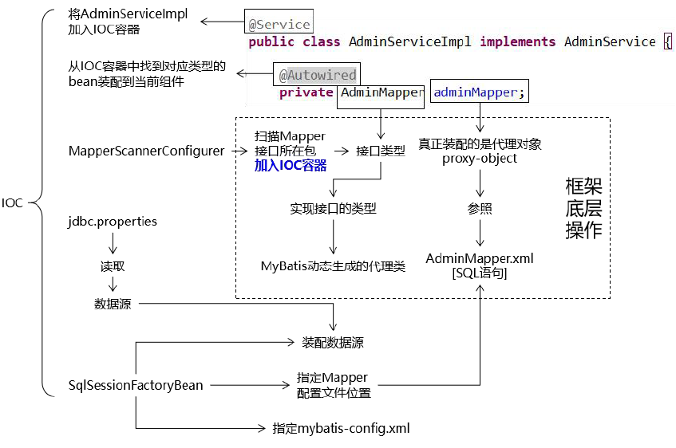
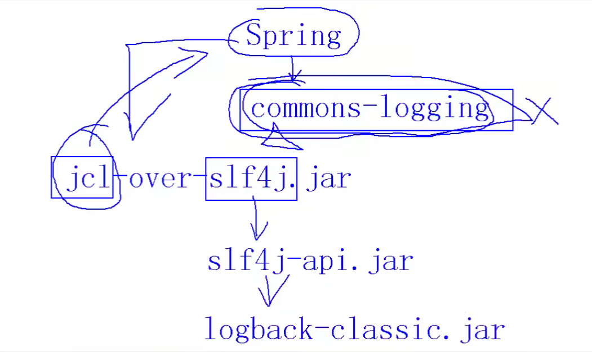
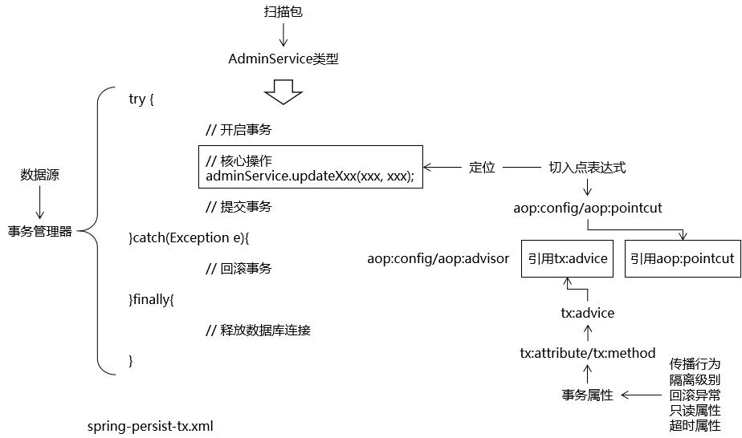
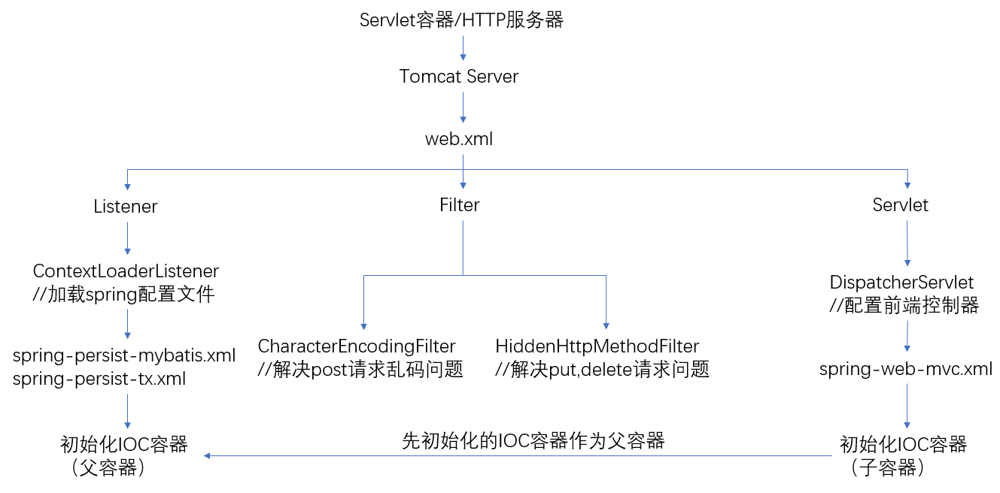
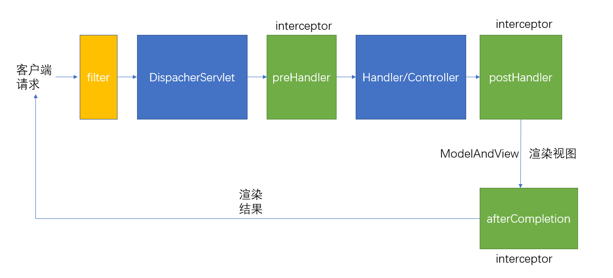
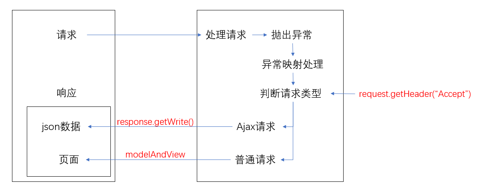
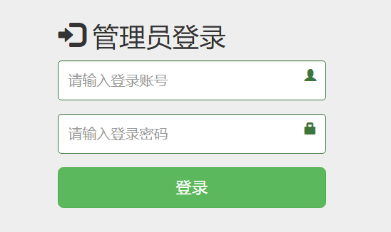
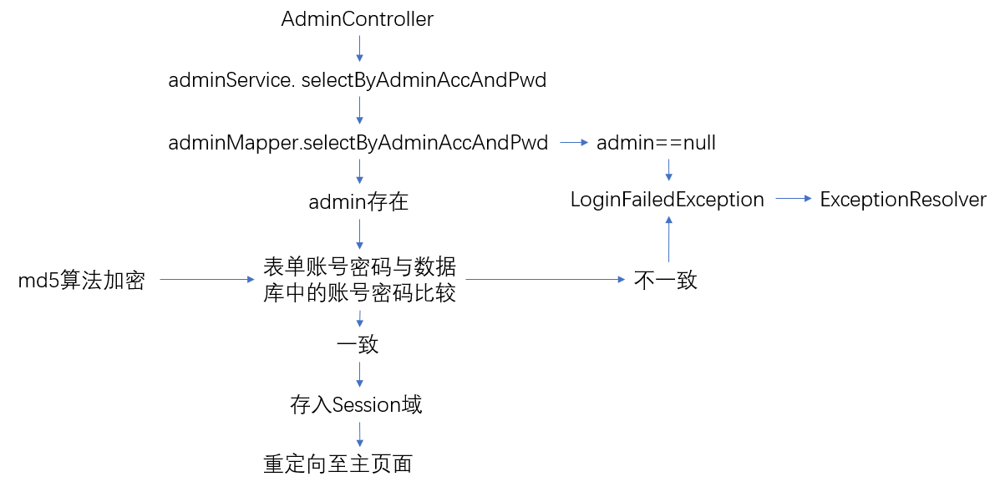

# 管理员系统

## 1 环境搭建

### 1.1  环境搭建总体目标

待写

### 1.2 创建数据库和数据库表

```sql	
DROP TABLE IF EXISTS admin;

CREATE TABLE admin(
	id int PRIMARY KEY auto_increment COMMENT '主键',
	login_acct VARCHAR(255) NOT NULL COMMENT '登录账号',
	user_pswd VARCHAR(255) NOT NULL COMMENT '登录密码',
	user_name VARCHAR(255) NOT NULL COMMENT '昵称',
	email VARCHAR(255) NOT NULL COMMENT '邮件地址',
	create_time date COMMENT '创建时间'
);

ALTER TABLE `admin` ADD UNIQUE INDEX (`login_acct`);
```

### 1.3 MyBatis 逆向工程

#### 1.3.1 依赖引入

```xml
<?xml version="1.0" encoding="UTF-8"?>
<project xmlns="http://maven.apache.org/POM/4.0.0"
         xmlns:xsi="http://www.w3.org/2001/XMLSchema-instance"
         xsi:schemaLocation="http://maven.apache.org/POM/4.0.0 http://maven.apache.org/xsd/maven-4.0.0.xsd">
    <modelVersion>4.0.0</modelVersion>

    <groupId>org.example</groupId>
    <artifactId>reverse</artifactId>
    <version>1.0-SNAPSHOT</version>
    <packaging>jar</packaging>
    <properties>
        <maven.compiler.source>11</maven.compiler.source>
        <maven.compiler.target>11</maven.compiler.target>
    </properties>

    <dependencies>
        <!-- https://mvnrepository.com/artifact/org.mybatis.generator/mybatis-generator-core -->
        <dependency>
            <groupId>org.mybatis.generator</groupId>
            <artifactId>mybatis-generator-core</artifactId>
            <version>1.3.7</version>
        </dependency>

        <!-- https://mvnrepository.com/artifact/mysql/mysql-connector-java -->
        <dependency>
            <groupId>mysql</groupId>
            <artifactId>mysql-connector-java</artifactId>
            <version>8.0.22</version>
        </dependency>

        <!-- https://mvnrepository.com/artifact/com.alibaba/druid -->
        <dependency>
            <groupId>com.alibaba</groupId>
            <artifactId>druid</artifactId>
            <version>1.2.6</version>
        </dependency>

    </dependencies>

</project>
```

#### 1.3.2 generatorConfig.xml

```xml
<!DOCTYPE generatorConfiguration PUBLIC
        "-//mybatis.org//DTD MyBatis Generator Configuration 1.0//EN"
        "http://mybatis.org/dtd/mybatis-generator-config_1_0.dtd">
<generatorConfiguration>
    <context id="simple" targetRuntime="MyBatis3Simple">
        <jdbcConnection driverClass="com.mysql.cj.jdbc.Driver"
                        connectionURL="jdbc:mysql://localhost:3306/exercise?serverTimezone=UTC"
                        userId="root"
                        password="bruce123"/>

        <!--实体类-->
        <javaModelGenerator targetPackage="com.admin.entity" targetProject="./crowfunding-admin/src/main/java"/>
        <!--映射文件-->
        <sqlMapGenerator targetPackage="/resources" targetProject="./crowfunding-admin/src/main"/>
        <!--接口类-->
        <javaClientGenerator type="XMLMAPPER" targetPackage="com.admin.mapper" targetProject="./crowfunding-admin/src/main/java"/>

        <table tableName="admin" />
    </context>
</generatorConfiguration>
```

#### 1.3.3 生成器

```java
public class Generator {
    public static void main(String[] args) {
        try {
            List<String> warnings = new ArrayList<String>();
            boolean overwrite = true;
            File configFile = new File("./crowfunding-common/reverse/src/main/resources/generatorConfig.xml");
            ConfigurationParser cp = new ConfigurationParser(warnings);
            Configuration config = cp.parseConfiguration(configFile);
            DefaultShellCallback callback = new DefaultShellCallback(overwrite);
            MyBatisGenerator myBatisGenerator = new MyBatisGenerator(config, callback, warnings);
            myBatisGenerator.generate(null);
        } catch (Exception e) {
            e.printStackTrace();
        }
    }
}
```

### 1.4 依赖引入

[pom.xml](./pom.xml)

### 1.5 Spring整合Mybatis

#### 1.5.1 配置数据库

```properties
jdbc.driver=com.mysql.cj.jdbc.Driver
jdbc.url=jdbc:mysql://localhost:3306/exercise?serverTimezone=UTC
jdbc.user=root
jdbc.password=bruce123
```

#### 1.5.2 配置spring-batis.xml

- 注册数据源`DataSource`
- 注册`SqlSessionFactoryBean`
- 注册`MapperScannerConfigurer`

```xml
<?xml version="1.0" encoding="UTF-8"?>
<beans xmlns="http://www.springframework.org/schema/beans"
       xmlns:xsi="http://www.w3.org/2001/XMLSchema-instance"
       xmlns:context="http://www.springframework.org/schema/context"
       xsi:schemaLocation="http://www.springframework.org/schema/beans
       http://www.springframework.org/schema/beans/spring-beans.xsd
       http://www.springframework.org/schema/context
       http://www.springframework.org/schema/context/spring-context.xsd">

    <!--扫描IOC组件-->
    <context:component-scan base-package="com.admin"/>

    <!--配置数据源-->
    <context:property-placeholder location="classpath:jdbc.properties"/>
    <bean id="dataSource" class="com.alibaba.druid.pool.DruidDataSource" destroy-method="close">
        <property name="driverClassName" value="${jdbc.driver}"/>
        <property name="url" value="${jdbc.url}"/>
        <property name="username" value="${jdbc.user}"/>
        <property name="password" value="${jdbc.password}"/>
    </bean>

    <!--配置SqlSessionFactoryBean-->
    <bean id="sqlSessionFactoryBean" class="org.mybatis.spring.SqlSessionFactoryBean">
        <!--装配数据源-->
        <property name="dataSource" ref="dataSource"/>
        <!--指定映射文件位置-->
        <property name="mapperLocations" value="classpath:mapper/*.xml"/>
    </bean>

    <!--配置MapperScannerConfigurer-->
    <bean class="org.mybatis.spring.mapper.MapperScannerConfigurer">
        <!--指定接口类所在包-->
        <property name="basePackage" value="com.admin.mapper"/>
    </bean>

    <bean id="adminService" class="com.admin.service.impl.AdminServiceImpl"/>
</beans>
```

#### 1.5.3 整合结果测试

创建`AdminService`接口和`AdminServiceImpl`实现类

在`AdminServiceImpl`中做CRUD的具体实现

```java
package com.admin.mapper;

public interface AdminMapper {
    Admin selectById(Integer id);
}
```

```java
package com.admin.service;

public interface AdminService {
    Admin selectById(Integer id);
}
```

```java
package com.admin.service.impl;

@Service
public class AdminServiceImpl implements AdminService {
    @Autowired
    AdminMapper adminMapper;

    @Override
    public Admin selectById(Integer id) {
        Admin admin = adminMapper.selectById(id);
        return admin;
    }
}
```



测试：

```java
@Test
public void test(){
    //加载配置文件中的bean加载到容器中
    ApplicationContext applicationContext = new ClassPathXmlApplicationContext("classpath:spring-mybatis.xml");
    AdminService adminService =(AdminServiceImpl) applicationContext.getBean("adminService");

    Admin admin = adminService.selectById(1);
    System.out.println(admin);
}
```

### 1.6 日志系统

#### 1.6.1 日志门面与实现

- 门面
  - JCL(Jakarta Commons Logging)
  - SLF4J(Simple Logging Facade for Java)

- 实现
  - log4j
  - JUL(java.util.logging)
  - log4j2
  - logback

>SLF4J,log4j,logback是同一作者
>
>log4j2是Apache收购log4j后进行全面重构，内部实现和log4j完全不同

#### 1.6.2 SLF4J日志系统整合

SLF4J是日志门面，只提供了API没有实现，需要其它日志来实现


SLF4J和logback-classic/log4j/jul的整合


这里我们使用SLF4J和logback-classic的整合。

需要注意的是，Spring自带**commons-logging**包，需要**排除**该jar包后引入引入日志框架中间转换包。



```xml
<!--日志-->
    <!-- https://mvnrepository.com/artifact/org.slf4j/slf4j-api -->
    <dependency>
        <groupId>org.slf4j</groupId>
        <artifactId>slf4j-api</artifactId>
        <version>1.7.32</version>
    </dependency>
    <!-- https://mvnrepository.com/artifact/ch.qos.logback/logback-classic -->
    <dependency>
        <groupId>ch.qos.logback</groupId>
        <artifactId>logback-classic</artifactId>
        <version>1.2.7</version>
        <scope>test</scope>
    </dependency>
    <!--其它日志框架中间转换包-->
    <!-- https://mvnrepository.com/artifact/org.slf4j/jcl-over-slf4j -->
    <dependency>
        <groupId>org.slf4j</groupId>
        <artifactId>jcl-over-slf4j</artifactId>
        <version>1.7.32</version>
    </dependency>

<!--
排除spring中自带的commons-logging
可能不止这个依赖需要排除，其它spring依赖可能也需要
-->
	<dependency>
            <groupId>org.springframework</groupId>
            <artifactId>spring-orm</artifactId>
            <version>5.3.13</version>
            <exclusions>
                <exclusion>
                    <groupId>commons-logging</groupId>
                    <artifactId>commons-logging</artifactId>
                </exclusion>
            </exclusions>
    </dependency>
```

#### 1.6.3 logback配置(简单配置)

```xml
<?xml version="1.0" encoding="UTF-8"?>
<configuration debug="true">
    <!-- 指定日志输出的位置-->
    <appender name="STDOUT"
              class="ch.qos.logback.core.ConsoleAppender">
        <encoder>
            <!-- 日志输出的格式-->
            <!-- 按照顺序分别是：时间、日志级别、线程名称、打印日志的类、日志主体
            内容、换行-->
            <pattern>[%d{HH:mm:ss.SSS}] [%-5level] [%thread] [%logger]
                [%msg]%n</pattern>
        </encoder>
    </appender>
    <!-- 设置全局日志级别。日志级别按顺序分别是：DEBUG、INFO、WARN、ERROR -->
    <!-- 指定任何一个日志级别都只打印当前级别和后面级别的日志。-->
    <root level="INFO">
        <!-- 指定打印日志的appender，这里通过“STDOUT”引用了前面配置的appender -->
        <appender-ref ref="STDOUT" />
    </root>
    <!-- 根据特殊需求指定局部日志级别-->
    <logger name="com.admin.SpringConfigTest" level="DEBUG"/>
</configuration>
```

#### 1.6.4 测试

```java
@Test
public void logTest(){
    // 获取Logger对象
    Logger logger = LoggerFactory.getLogger(SpringConfigTest.class);

    logger.debug("debug level");
    logger.info("info level");
    logger.warn("warn level");
    logger.error("error level");
}
```

### 1.7 声明式事务

>事务是数据库操作最基本单元，逻辑上一组操作，要么都成功，如果有一个失败所有操作都失败。
>
>Spring中声明式事务管理有两种：基于xml和基于注解。
>
>该项目中使用的是基于xml方式

#### 1.7.1 编程式事务

```java
try {
    // 核心操作前：开启事务（关闭自动提交）
    // 对应AOP 的前置通知
    connection.setAutoCommit(false);
    // 核心操作
    adminService.updateXxx(xxx, xxx);
    // 核心操作成功：提交事务
    // 对应AOP 的返回通知
    connection.commit();
    }catch(Exception e){
    // 核心操作失败：回滚事务
    // 对应AOP 的异常通知
    connection.rollBack();
    }finally{
    // 不论成功还是失败，核心操作终归是结束了
    // 核心操作不管是怎么结束的，都需要释放数据库连接
    // 对应AOP 的后置通知
    if(connection != null){
    	connection.close();
    }
}
```

编程式事务每次都需要开启事务，关闭事务等操作，会造成代码臃肿，所以使用声明式事务来简化。

#### 1.7.2 基于xml的声明式事务管理

- 思路：



- 引入AOP依赖

  ```XML
  <!-- https://mvnrepository.com/artifact/org.aspectj/aspectjweaver -->
  <dependency>
      <groupId>org.aspectj</groupId>
      <artifactId>aspectjweaver</artifactId>
      <version>1.9.6</version>
      <scope>runtime</scope>
  </dependency>
  <!-- https://mvnrepository.com/artifact/cglib/cglib -->
  <!--没有接口时使用CGLIB动态代理-->
  <dependency>
      <groupId>cglib</groupId>
      <artifactId>cglib</artifactId>
      <version>3.3.0</version>
  </dependency>
  ```

- 创建spring-tx.xml配置文件

  ```xml
  <!--配置事务管理器-->
  <bean id="dataSourceTransactionManager" class="org.springframework.jdbc.datasource.DataSourceTransactionManager">
      <property name="dataSource" ref="dataSource"/>
  </bean>
  
  <!--配置aop-->
  <aop:config>
      <!--配置切入点-->
      <aop:pointcut id="pointCut" expression="execution(* *..*service.impl.*(..))"/>
      <!--配置切面：将通知应用到切入点-->
      <aop:advisor advice-ref="advisor" pointcut-ref="pointCut"/>
  </aop:config>
  
  <!--配置事务通知-->
  <!--transaction-manager 属性用于引用事务管理器-->
  <tx:advice id="advisor" transaction-manager="dataSourceTransactionManager">
      <tx:attributes>
          <!--name 属性指定当前要配置的事务方法的方法名
              一般将查询方法设置为只读，便于数据库根据只读属性进行相关性能优化-->
          <tx:method name="get*" read-only="true"/>
          <tx:method name="select*" read-only="true"/>
          <tx:method name="query*" read-only="true"/>
          <tx:method name="find*" read-only="true"/>
          <tx:method name="count*" read-only="true"/>
  
          <!--增删改查方法-->
          <!-- propagation 属性配置事务方法的传播行为
              默认值：REQUIRED 表示：当前方法必须运行在事务中，如果没有事务，则开
              启事务，在自己的事务中运行。如果已经有了已开启的事务，则在当前事务中运行。有可能
              和其他方法共用同一个事务。
              建议值：REQUIRES_NEW 表示：当前方法必须运行在事务中，如果没有事务，
              则开启事务，在自己的事务中运行。和REQUIRED 的区别是就算现在已经有了已开启的事务，
              也一定要开启自己的事务，避免和其他方法共用同一个事务。-->
          <!-- rollback-for 属性配置回滚的异常
               默认值：运行时异常
               建议值：编译时异常+运行时异常-->
          <tx:method name="insert*" propagation="REQUIRES_NEW" rollback-for="java.lang.Exception"/>
          <tx:method name="update*" propagation="REQUIRES_NEW" rollback-for="java.lang.Exception"/>
          <tx:method name="delete*" propagation="REQUIRES_NEW" rollback-for="java.lang.Exception"/>
      </tx:attributes>
  </tx:advice>
  ```

#### 1.7.3 基于注解的声明式事务管理

- 在配置文件中开启事务注解

  ```xml
  <!--开启事务注解--> 
  <tx:annotation-driven transaction-manager="transactionManager"/>
  ```

- 使用注解

  - @Transactional，这个注解添加到类上面，也可以添加方法上面
  - 如果把这个注解添加类上面，这个类里面所有的方法都添加事务
  - 如果把这个注解添加方法上面，为这个方法添加事务

  ```java
  @Service
  @Transactional
  public class AdminServiceImpl {}
  ```

### 1.8 表述层搭建

#### 1.8.1 Tomcat服务器启动过程



#### 1.8.2 spring mvc执行流程



#### 1.8.3 引入依赖

```xml
        <!--servlet-->
        <!-- https://mvnrepository.com/artifact/javax.servlet/javax.servlet-api -->
        <dependency>
            <groupId>javax.servlet</groupId>
            <artifactId>javax.servlet-api</artifactId>
            <version>4.0.1</version>
            <scope>provided</scope>
        </dependency>
        <!--jsp页面依赖-->
        <!-- https://mvnrepository.com/artifact/javax.servlet.jsp/javax.servlet.jsp-api -->
        <dependency>
            <groupId>javax.servlet.jsp</groupId>
            <artifactId>javax.servlet.jsp-api</artifactId>
            <version>2.3.3</version>
            <scope>provided</scope>
        </dependency>
```

#### 1.8.4 配置web.xml

web.xml文件放在src/main/web/WEB-INF

```xml
<!-- 指定Spring配置文件所在目录-->
<context-param>
    <param-name>contextConfigLocation</param-name>
    <param-value>classpath:spring-persist-tx.xml</param-value>
</context-param>

<!-- 配置ContextLoaderListener 加载 Spring配置文件-->
<listener>
    <listener-class>
        org.springframework.web.context.ContextLoaderListener
    </listener-class>
</listener>

<!-- 配置 解决Post请求字符乱码的问题-->
<!-- 此filter必须在所有filter前面 -->
<filter>
    <filter-name>characterEncodingFilter</filter-name>
    <filter-class>org.springframework.web.filter.CharacterEncodingFilter</filter-class>
    <!--指定字符集-->
    <init-param>
        <param-name>encoding</param-name>
        <param-value>UTF-8</param-value>
    </init-param>
    <!--强制请求编码-->
    <init-param>
        <param-name>forceRequestEncoding</param-name>
        <param-value>true</param-value>
    </init-param>
    <!-- 强制响应进行编码-->
    <init-param>
        <param-name>forceResponseEncoding</param-name>
        <param-value>true</param-value>
    </init-param>
</filter>
<filter-mapping>
    <filter-name>characterEncodingFilter</filter-name>
    <url-pattern>/*</url-pattern>
</filter-mapping>

<!-- 配置前端控制器 -->
<servlet>
    <servlet-name>dispatcherServlet</servlet-name>
    <servlet-class>org.springframework.web.servlet.DispatcherServlet</servlet-class>
    <!--指定SpringMvc的配置文件所在位置-->
    <init-param>
        <param-name>contextConfigLocation</param-name>
        <param-value>classpath:spring-web-mvc.xml</param-value>
    </init-param>

    <load-on-startup>1</load-on-startup>
</servlet>
<servlet-mapping>
    <servlet-name>dispatcherServlet</servlet-name>
    <url-pattern>/</url-pattern>
</servlet-mapping>
```

#### 1.8.5 配置spring-web-mvc.xml（配置前端控制器）

```xml
<context:component-scan base-package="com.admin.controller"/>

<!-- 配置视图解析器 -->
<bean id="vireResolver" class="org.springframework.web.servlet.view.InternalResourceViewResolver">
    <!--视图前缀-->
    <property name="prefix" value="/"/>
    <!--视图后缀-->
    <property name="suffix" value=".html"/>
</bean>

<!--
    处理静态资源，例如html、js、css、jpg
    若只设置该标签，则只能访问静态资源，其他请求则无法访问
    此时必须设置<mvc:annotation-driven/>解决问题
    -->
<mvc:default-servlet-handler/>

<!-- 启用注解驱动-->
<mvc:annotation-driven/>
```

#### 1.8.6 测试

```java
@Controller
public class ControllerTest {

    @RequestMapping("/test")
    public String test(){
        return "success";
    }
}
```

### 1.9 异常映射

#### 1.9.1 工作机制



浏览器请求可能是Ajax请求，也可能是普通请求。

如果是普通请求，处理后返回ModelAndView对象。

如果是Ajax请求，返回json数据。注意，需要对返回的json数据进行封装处理，否则，前端不知道这个json数据是正常的还是异常信息。

#### 1.9.2 json统一结果封装

ResultEntity用于统一项目中所有Ajax请求返回值类型

```java
@Data
@NoArgsConstructor
@AllArgsConstructor
public class ResultEntity<T> {
    private String operationResult;
    private String operationMessage;
    private T data;

    // operationResult
    public static final String SUCCESS = "SUCCESS";
    public static final String FAILE = "FAILE";
    // operationMessage
    public static final String NO_MESSAGE = "NO_MESSAGE";
    public static final String NO_DATA = "NO_DATA";

    /**
     * 返回操作结果，成功，不带数据
     * @param <E> 泛型
     * @return
     */
    public static <E> ResultEntity<E> successWithoutData(){
        return new ResultEntity<E>(SUCCESS,NO_MESSAGE,null);
    }

    /**
     * 返回操作结果，成功，携带数据
     * @param data 请求的数据
     * @param <E> 数据类型
     * @return
     */
    public static <E> ResultEntity<E> successWithData(E data){
        return new ResultEntity<E>(SUCCESS,NO_MESSAGE,data);
    }

    /**
     * 返回操作结果，错误
     * @param message
     * @param <E>
     * @return
     */
    public static <E> ResultEntity<E> fail(String message){
        return new ResultEntity<E>(FAILE,message,null);
    }
}
```

#### 1.9.3 判断请求类型

AdminUtil中的judgeAjaxRequest方法用于判断请求类型是Ajax请求还是普通请求

根据请求头中的Accept:application/json或者X-Request-With:XMLHttpRequest时，请求类型为Ajax请求

```java
/**
     * 判断请求是否为Ajax请求
     * @param request
     * @return 如果请求头信息中的Accept:application/json或X-Request-With:XMLHttpRequest返回true
     */
public static boolean judgeAjaxRequest(HttpServletRequest request){
    String accept = request.getHeader("Accept");
    String xRequestWith = request.getHeader("X-Request-With");

    return((accept != null && accept == "application/json")||
           (xRequestWith != null && xRequestWith == "XMLHttpRequest"));

}
```

#### 1.9.4 实现异常映射

可以通过xml配置或者配置类来实现：

- 当使用`mvc:view-controller`，使用xml配置
- 当使用`@RequestMapping`，使用配置类来配置

这里我使用配置类来实现

```java
@ControllerAdvice //表示当前类是一个处理异常的类
public class ExceptionResolver {

	//todo 具体异常

    /**
     * 异常处理的核心方法，具体异常处理调用该方法即可
     * @param exception
     * @param request
     * @param response
     * @param viewName 视图名称
     * @return
     * @throws IOException
     */
    private ModelAndView commonExceptionResolver(Exception exception,
                                                 HttpServletRequest request,
                                                 HttpServletResponse response,
                                                 String viewName) throws IOException {
        // 1.判断是当前请求是普通请求还是Ajax请求（普通请求需要返回页面，Ajax请求只需要返回jason）
        boolean judgeAjaxRequest = AdminUtil.judgeAjaxRequest(request);
        // 2.如果是Ajax请求
        if(judgeAjaxRequest){
            // 3.获取错误信息
            String message = exception.getMessage();
            // 4.创建ResultEntity对象，统一Ajax请求的返回类型
            ResultEntity<Object> resultEntity = ResultEntity.fail(message);
            // 5.创建gson对象，将resultEntity转换为json字符串
            Gson gson = new Gson();
            String json = gson.toJson(resultEntity);
            // 6.返回json
            PrintWriter writer = response.getWriter();
            writer.write(json);
            // 7.返回null，不返回ModelAndView对象
            return null;
        }

        // 如果是普通请求
        // 8.创建ModelAndView对象
        ModelAndView modelAndView = new ModelAndView();
        // 9.将Exception存入对象
        modelAndView.addObject("Exception",exception);
        // 10.设置目标视图名称
        modelAndView.setViewName("viewName");
        // 11.返回modelAndView对象
        return modelAndView;
    }
}
```

## 2 管理员登录功能



### 2.1 实现流程



### 2.2 md5加密

```java
/**
* md5加密
* @param source
* @return
*/
public static String encrypt(String source){
    // 1.判断传入的字符串是否有效
    if(source == null || source.length() == 0){
        throw new LoginFailedException(CrowFundingConstant.MESSAGE_STRING_INVALIDATE);
    }

    try {
        String algorithm = "md5";
        // 2.获取 MessageDigest 对象
        MessageDigest messageDigest = MessageDigest.getInstance(algorithm);
        // 3.获得明文字符串对应的字节数组
        byte[] bytes = source.getBytes();
        // 4.使用字节数组进行加密
        byte[] digest = messageDigest.digest(bytes);
        // 5.字节数组转换为十六进制再转化成字符串
        BigInteger bigInteger = new BigInteger(1, digest);
        String cryptograph = bigInteger.toString(16).toUpperCase();

        return cryptograph;
    } catch (NoSuchAlgorithmException e) {
        e.printStackTrace();
    }
    return null;
}
```

### 2.3 登录异常类

自定义异常类

```java
public class LoginFailedException extends RuntimeException{
    static final long serialVersionUID = 1L;

    public LoginFailedException() {
        super();
    }

    public LoginFailedException(String message) {
        super(message);
    }

    public LoginFailedException(String message, Throwable cause) {
        super(message, cause);
    }

    public LoginFailedException(Throwable cause) {
        super(cause);
    }

    protected LoginFailedException(String message, Throwable cause, boolean enableSuppression, boolean writableStackTrace) {
        super(message, cause, enableSuppression, writableStackTrace);
    }
}
```

### 2.4 登录异常处理

在异常处理类中添加处理登录异常的处理方法

```java
/**
* 管理员登录异常
* @param loginFailedException
* @param request
* @param response
* @return
* @throws IOException
*/
@ExceptionHandler(value = LoginFailedException.class)
public ModelAndView resloveLoginException(LoginFailedException loginFailedException,
                                          HttpServletRequest request,
                                          HttpServletResponse response)throws IOException{

    String viewName = "admin-login";

    return commonExceptionResolver(loginFailedException,request, response,viewName);
}
```

### 2.5 管理员登录界面

```java
/**
* 管理员提交账号密码，之后跳转到主页面
* @param adminAcc
* @param adminPwd
* @param session
* @return
*/
@RequestMapping(value = "/login",method = RequestMethod.POST)
public String adminLogin(@RequestParam("adminAcc")String adminAcc,
                         @RequestParam("adminPwd")String adminPwd,
                         HttpSession session){
    // 传入账号密码与数据库进行对比
    Admin admin = adminService.selectByAdminAccAndPwd(adminAcc, adminPwd);
    // 将管理员信息放入session域中
    session.setAttribute(CrowFundingConstant.ADAMIN_LOGIN_NAME,admin);

    // TODO 将sout换成logger.info
    System.out.println(admin);

    return "redirect:/main";
}

/**
* 管理员登录界面
* @return
*/
@RequestMapping(value = "/login",method = RequestMethod.GET)
public String adminLoginPage(){
    return "admin-login";
}

```

### 2.6 数据库查询管理员信息

```java
/**
* 将管理员输入的密码进行md5加密后与数据库中的密文对比，若相同则返回该管理员对象
* @param adminAccount
* @param adminPassword
* @return
*/
@Override
public Admin selectByAdminAccAndPwd(String adminAccount, String adminPassword) {
    // 将明文进行加密
    String encrypt = CrowFundingUtil.encrypt(adminPassword);
    // 将账号和密文与数据库中的管理员账号对比
    Admin admin = adminMapper.selectByAdminAccAndPwd(adminAccount, encrypt);

    if(admin == null){
        throw new LoginFailedException(CrowFundingConstant.MESSAGE_LOGIN_FAILED);
    }

    return admin;
}
```

### 2.7 退出登录

```java
/**
* 退出登录，重定向至管理员登录页面
* @param session
* @return
*/
@RequestMapping(value = "/logout")
public String adminLogOut(HttpSession session){
    // 强制session失效
    session.invalidate();

    return "redirect:/login";
}
```

### 2.8 登录状态检测

拦截未登录用户

拦截器类：

```java
public class LoginInterceptor implements HandlerInterceptor {
    @Override
    public boolean preHandle(HttpServletRequest request, HttpServletResponse response, Object handler) throws Exception {

        // 获取Session域中的对象
        HttpSession session = request.getSession();
        Admin admin = (Admin) session.getAttribute(CrowFundingConstant.ADAMIN_LOGIN_NAME);

        // 若Session域中取得的对象为null，抛出登录异常
        if(admin == null){
            throw new LoginFailedException(CrowFundingConstant.MESSAGE_ACCESS_FORBIDEN);
        }

        return true;
    }
}
```

配置拦截器：

```xml
<mvc:interceptors>
    <mvc:interceptor>
        <!-- 拦截多层路径-->
        <mvc:mapping path="/**"/>
        <!-- 不拦截的路径-->
        <mvc:exclude-mapping path="/login"/>
        <mvc:exclude-mapping path="/logout"/>
        <!-- 配置拦截器类-->
        <bean class="com.admin.interceptor.LoginInterceptor"/>
    </mvc:interceptor>
</mvc:interceptors>
```

### 2.9 未登录异常类

自定义异常

```java
public class AccessForbiddenException extends RuntimeException{
    public AccessForbiddenException() {
        super();
    }

    public AccessForbiddenException(String message) {
        super(message);
    }

    public AccessForbiddenException(String message, Throwable cause) {
        super(message, cause);
    }

    public AccessForbiddenException(Throwable cause) {
        super(cause);
    }

    protected AccessForbiddenException(String message, Throwable cause, boolean enableSuppression, boolean writableStackTrace) {
        super(message, cause, enableSuppression, writableStackTrace);
    }
}
```

### 2.10 未登录异常处理

```java
/**
* 未登录访问主页异常
* @param accessForbiddenException
* @param request
* @param response
* @return
* @throws IOException
*/
@ExceptionHandler(value = AccessForbiddenException.class)
public ModelAndView resloveAccessForbiddenException(AccessForbiddenException accessForbiddenException,
                                                    HttpServletRequest request,
                                                    HttpServletResponse response) throws IOException {

    String  viewName = "admin-login";

    return commonExceptionResolver(accessForbiddenException,request,response,viewName);
}
```

### 2.11 注意

​	本项目中由于crowfunding-admin模块和crowfunding-util没有共同的父模块，所有当启动Tomcat服务器后找不到crowfunding-util模块中的类，此时报错：`NoClassDefFoundException`，`ClassNotFoundException`。

​	解决方式：在当前工程目录下的`out\artifacts\crowfunding_admin_war_exploded\WEB-INF\classes\com`下添加com.util包下的所有编译文件。或者将当前工程作为crowfunding-admin和crowfunding-util的父模块。

## 3 管理员管理功能

### 3.1 分页显示信息

以分页的形式显示管理员信息，并可以通过关键字来查询，当不知道关键字时，默认查询所有。

#### 3.1.1 sql语句

```xml
<select id="selectByKeyWord" resultMap="BaseResultMap">
    select * from admin where login_acct like concat('%',#{keyword},'%')
    						or user_name like concat('%',#{keyword},'%')
    						or email like concat('%',#{keyword},'%')
  <!--keyword有值：like %kongnang%
	  keyword无值：like %%
	-->
</select>
```

#### 3.1.2 AdminServiceImpl实现

```java
@Override
public PageInfo<Admin> selectByKeyWord(String keyword, Integer pageNum, Integer pageSize) {
    // 1.开启分页插件
    PageHelper.startPage(pageNum,pageSize);
    // 2.根据关键字进行查询
    List<Admin> admins = adminMapper.selectByKeyWord(keyword);

    // 3.将查询结果封装到PageInfo中
    PageInfo<Admin> pageInfo = new PageInfo(admins);

    return pageInfo;
}
```

#### 3.1.3 AdminController实现

```java
@RequestMapping(value = "/usermaintain")
public String adminInfoResult(@RequestParam(value ="keyword",defaultValue = "")String keyword,
                              @RequestParam(value = "pageNum",defaultValue = "1")Integer pageNum,
                              @RequestParam(value = "pageSize",defaultValue = "5")Integer pageSize,
                              ModelMap modelMap){

    // 查询数据
    PageInfo<Admin> pageInfo = adminService.selectByKeyWord(keyword, pageNum, pageSize);

    // 将查询结果存入ModelMap
    // 使用ModelMap获取管理员信息显示在jsp页面
    modelMap.addAttribute(CrowFundingConstant.USER_MAINTAIN_PAGE,pageInfo);

    return "admin-maintain";
}
```

### 3.2 添加管理员

#### 3.2.1 sql语句

```xml
<insert id="insertAdmin" parameterType="com.admin.entity.Admin">
    insert into admin values (#{id} ,#{loginAcct} ,#{userPswd} ,#{userName} ,#{email} ,#{createTime} )
</insert>
```

#### 3.2.2 账号重复异常处理

```java
@ExceptionHandler(value = LoginAcctAlreadyInUseException.class)
public ModelAndView resloveLoginAcctAlreadyInUseException(LoginFailedException loginFailedException,
                                                          HttpServletRequest request,
                                                          HttpServletResponse response) throws IOException {
    String viewName = "admin-add";

    return commonExceptionResolver(loginFailedException,request,response,viewName);
}
```

#### 3.2.3 ServiceImpl实现

```java
@Override
public Boolean insertAdmin(Admin admin) {
    // 加密管理员密码
    String encrypt = CrowFundingUtil.encrypt(admin.getUserPswd());

    admin.setUserPswd(encrypt);

    Boolean res = false;
    // 保存管理员对象到数据库中，如果用户名被占用抛出异常
    try{
        res = adminMapper.insertAdmin(admin);
    }catch (Exception e){
        // 若当前异常类是DuplicateKeyException的实例对象，说明账号名重复
        if(e instanceof DuplicateKeyException){
            throw new LoginAcctAlreadyInUseException(CrowFundingConstant.MESSAGE_LOGIN_ACCOUNT_ALREADY_IN_USE);
        }
        // 为了不掩盖错误仍然抛出当前异常
        throw e;
    }finally {
        return res;
    }
}
```

#### 3.2.4 Controller实现

```java
/**
     * 跳转至添加管理员页面
     * @return
     */
@RequestMapping(value = "/add")
public String addAdminPage(){
    return "admin-add";
}

/**
     * 添加管理员
     * @param request 保存sql执行结果
     * @param loginAcct
     * @param userName
     * @param email
     * @return
     */
@RequestMapping(value = "/add" ,method = RequestMethod.POST)
public String addAdmin(HttpServletRequest request,
                       @RequestParam("loginAcct")String loginAcct,
                       @RequestParam("userName")String userName,
                       @RequestParam("email")String email){

    Date date = new Date();
    Admin admin =new Admin(null,loginAcct,"123",userName,email,date);

    // 将保存的对象存入数据库
    Boolean res = adminService.insertAdmin(admin);

    // 将操作结果放入域中
    if(res == true){
        request.setAttribute("res","添加成功！");
    }else{
        request.setAttribute("res","添加失败！");
    }

    return "admin-add";
}
```

### 3.3 删除管理员

#### 3.3.1 sql语句

```xml
<delete id="deleteAdminById" parameterType="Integer">
    delete from admin where id = #{id}
</delete>
```

#### 3.3.2 ServiceImpl实现

```java
@Override
public Boolean deleteAdminById(Integer id) {
    Boolean res = false;

    try{
        res = adminMapper.deleteAdminById(id);
    }catch (Exception e){
        throw e;
    }finally {
        return res;
    }
}
```

#### 3.3.3 Controller实现

```java
@RequestMapping(value = "/delete/{id}/{pageNum}")
public String deleteAdmin(HttpServletRequest request,
                          @PathVariable("id")Integer id,
                          @PathVariable("pageNum")Integer pageNum){

    Boolean res = adminService.deleteAdminById(id);

    if(res == true){
        request.setAttribute("res","删除成功！");
    }else{
        request.setAttribute("res","删除失败！");
    }

    return "redirect:/usermaintain";
}
```

### 3.4 更新管理员

#### 3.4.1 sql语句

```xml	
<update id="updateAdminById" parameterType="com.admin.entity.Admin">
    update admin set login_acct=#{loginAcct},
    				user_name=#{userName},
    				email=#{email} where id=#{id}
</update>
```

#### 3.4.2 ServiceImpl实现

```java
@Override
public Boolean updateAdminById(Admin admin) {
    Boolean res = false;

    try{
        res = adminMapper.updateAdminById(admin);
    }catch (Exception e){
        throw e;
    }finally {
        return res;
    }
}
```

#### 3.4.3 Controller实现

```java
/**
     * 跳转到管理员修改页面
     * @param session 把取得的管理员信息放在session中方便后面使用
     * @param id 由查询页面中的管理员信息获得
     * @return
     */
@RequestMapping(value = "/update")
public String updatePage(@RequestParam("id")Integer id,
                         HttpSession session){
    // 查询指定id的管理员信息，并放入请求域中以便显示在表单中
    Admin admin = adminService.selectById(id);
    session.setAttribute("updateAdmin",admin);

    return "admin-update";
}

/**
     * 实现修改功能
     * @param loginAcct
     * @param userName
     * @param email
     * @param session 通过session域获得当前修改的管理员对象
     * @param request 保存sql执行结果
     * @return
     */
@RequestMapping(value = "/update" , method = RequestMethod.POST)
public String updateAdmin(@RequestParam("loginAcct")String loginAcct,
                          @RequestParam("userName")String userName,
                          @RequestParam("email")String email,
                          HttpSession session,
                          HttpServletRequest request){

    Admin admin = (Admin) session.getAttribute("updateAdmin");
    admin.setLoginAcct(loginAcct);
    admin.setUserName(userName);
    admin.setEmail(email);

    Boolean res = adminService.updateAdminById(admin);
    if(res == true){
        request.setAttribute("res","修改成功");
    }else{
        request.setAttribute("res","修改失败");
    }

    return "redirect:/usermaintain";
}
```

