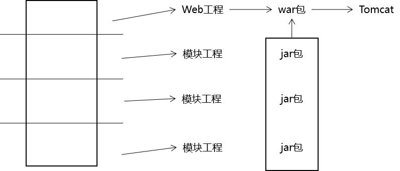
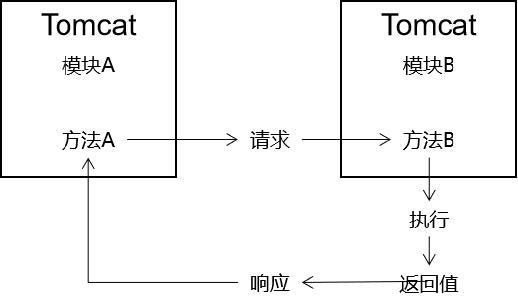

# Crow Funding众筹项目

## 1 项目介绍

帮助创业者发布创业项目，向大众募集启动资金的融资平台

此项目来源于尚硅谷-尚筹网项目

[视频地址](https://www.bilibili.com/video/BV1bE411T7oZ)

## 2 项目架构

后台管理员系统使用**ssm**单一架构

前台管理员系统使用**SpringBoot**分布式架构

### 单一架构与分布式架构

- 单一架构一般指一个工程运行在一个Tomcat上

  

- 分布式架构一般指一个项目分成多个模块工程，运行在各自的Tomcat上

  
