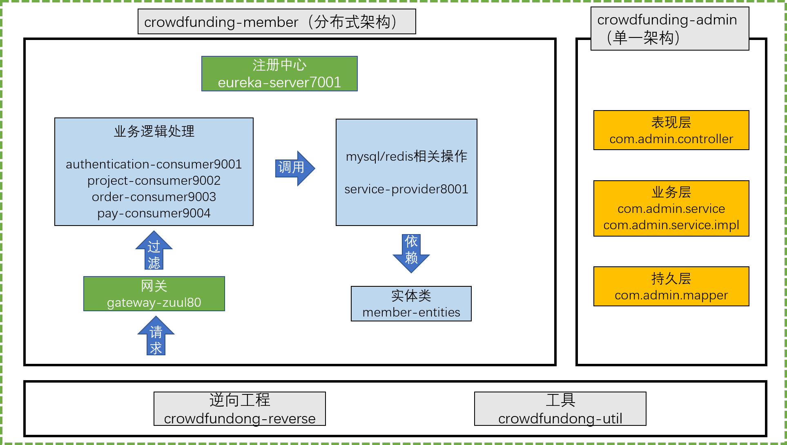

# Crow Funding众筹项目

## 1 项目介绍

帮助创业者发布创业项目，向大众募集启动资金的融资平台

此项目来源于尚硅谷-尚筹网项目

[视频地址](https://www.bilibili.com/video/BV1bE411T7oZ)

## 2 项目架构

后台管理员系统使用**ssm**单一架构

前台管理员系统使用**Spring Boot,Spring Cloud**分布式架构

## 3 项目环境

- jdk 11
- maven 3.8.3
- git 2.33.1

## 4 管理员系统

### 4.1 环境搭建

#### 4.1.1  环境搭建总体目标

#### 4.1.2 建立maven多模块管理

#### 4.1.3 创建数据库和数据库表

#### 4.1.4 MyBatis 逆向工程

#### 4.1.5 父工程依赖引入

#### 4.1.6 子工程依赖引入

考虑到依赖关系，将依赖引入到component模块的pom.xml下

#### 4.1.7 Spring整合Mybatis

### 4.2日志系统
